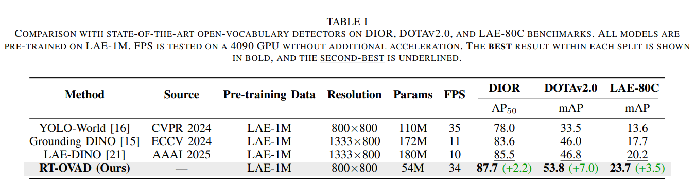
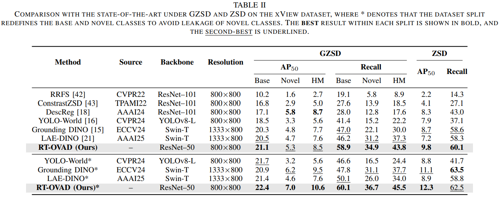
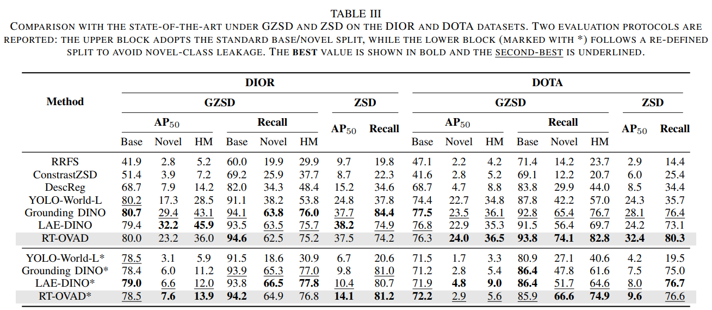
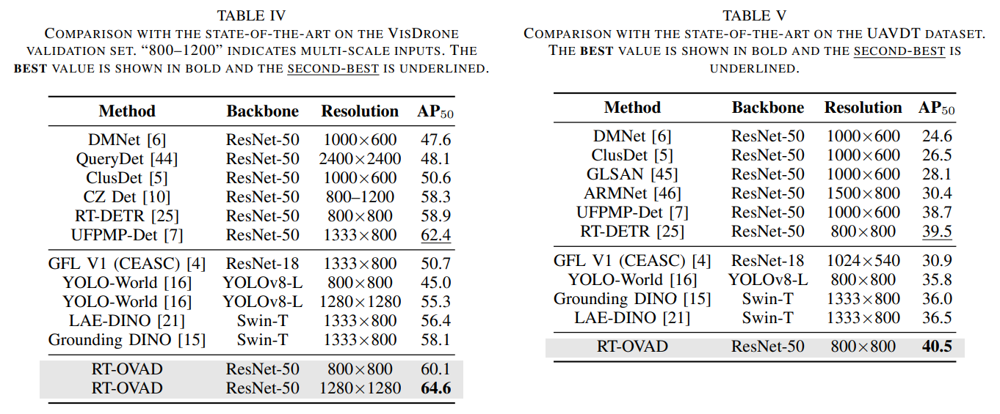

<p align="center">
  
</p>

## RT-OVAD: Real-Time Open-Vocabulary Aerial Object Detection via Image-Text Collaboration

[](https://arxiv.org/abs/2408.12246)

<p align="center">
  <i>
    Guoting Wei<sup>1,4*</sup>, Xia Yuan<sup>1*</sup>, Yu Liu<sup>3*</sup>, Zhenhao Shang<sup>2</sup>, Xizhe Xue<sup>2</sup>, Peng Wang<sup>2</sup>,  Kelu Yao<sup>3</sup> <br>
    Chunxia Zhao<sup>1</sup>, Haokui Zhang<sup>2,4†</sup>, Rong Xiao<sup>4</sup>
  </i>
</p>

<p align="center">
  <sup>*</sup>Equal Contribution &nbsp;&nbsp;&nbsp; <sup>†</sup>Corresponding Author
</p>

---

### 🏢 Affiliations

- <sup>1</sup> Nanjing University of Science and Technology
- <sup>2</sup> Northwestern Polytechnical University
- <sup>3</sup> Zhejiang Lab
- <sup>4</sup> Intellifusion Inc. 


---

## 📝 **TODO**:
🚀 Resources will be made publicly available after paper acceptance.

- 🔲 Data preprocessing scripts 

- 🔲 Training & evaluation code

- 🔲 Pretrained model weights


---

## 🔍 Abstract

Aerial object detection plays a crucial role in numerous applications. However, most existing methods focus on detecting predefined object categories, limiting their applicability in real-world open scenarios. In this paper, we extend aerial object detection to open scenarios through image-text collaboration and propose RT-OVAD, the first real-time open-vocabulary detector for aerial scenes. 
Specifically, we first introduce an image-to-text alignment loss to replace the conventional category regression loss, thereby eliminating category constraints. 
Next, we propose a lightweight image–text collaboration strategy comprising an image–text collaboration encoder and a text-guided decoder. The encoder simultaneously enhances visual features and refines textual embeddings, while the decoder guides object queries to focus on class-relevant image features. This design further improves detection accuracy without incurring significant computational overhead.
Extensive experiments demonstrate that RT-OVAD consistently outperforms existing state-of-the-art methods across open-vocabulary, zero-shot, and traditional closed-set detection tasks. For instance, on the open-vocabulary aerial detection benchmarks DIOR, DOTA-v2.0, and LAE-80C, RT-OVAD achieves 87.7 $AP_{50}$, 53.8 mAP, and 23.7 mAP, respectively, surpassing the previous state-of-the-art (LAE-DINO) by 2.2, 7.0, and 3.5 points. In addition, RT-OVAD achieves an inference speed of 34 FPS on an RTX 4090 GPU, approximately three times faster than LAE-DINO (10 FPS), meeting the real-time detection requirements of diverse applications. 

---

## ✨ Highlights

- 🏷️ **Open-vocabulary detection** enabled by image-text alignment.
- ⚡ **Real-time inference**: 34 FPS on RTX 4090.
- 🔁 **Image–text collaboration** via a lightweight image–text collaboration strategy.
- 📈 **SOTA performance** across Open-Vocabulary Aerial Detection, Zero-Shot Detection, and Closed-set Detection tasks.

---


---

## 📊 Results

### 1. Open-Vocabulary Aerial Detection

<p align="center">
  
</p>

### 2. Zero-shot Aerial Detection

<p align="center">
  
</p>

<p align="center">
  
</p>

### 3. Closed-Set Aerial Detection

<p align="center">
  
</p>


---

## 📦 Datasets

RT-OVAD is trained and evaluated on:

### 1. Open-Vocabulary Aerial Detection
- **Training**: LAE-1M
- **Evaluation**: DIOR, DOTA-v2.0, LAE-80C

### 2. Zero-Shot Aerial Detection
- Training: DIOR, DOTA, xView Base data
- GZSD & ZSD evaluation: DIOR, DOTA, xView (Base/novel split)

### 3. Closed-Set Aerial Detection
- VisDrone, UAVDT

---

## 📄 Citation

```bibtex
@misc{wei2024rtovad,
    title={RT-OVAD: Real-Time Open-Vocabulary Aerial Object Detection via Image-Text Collaboration},
    author={Guoting Wei and Xia Yuan and Yu Liu and Zhenhao Shang and Xizhe Xue and Peng Wang and Kelu Yao and Chunxia Zhao and Haokui Zhang and Rong Xiao},
    year={2024},
    eprint={2408.12246},
    archivePrefix={arXiv},
    primaryClass={cs.CV}
}
```

---

## 🤝 Contact

- 📧 Guoting Wei (weiguoting@njust.edu.cn)
- 📧 Haokui Zhang (zhkui@njust.edu.cn)

---
